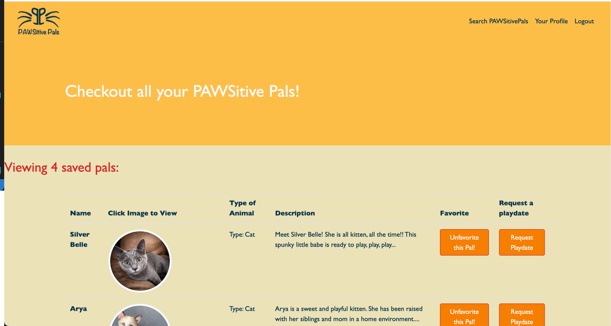
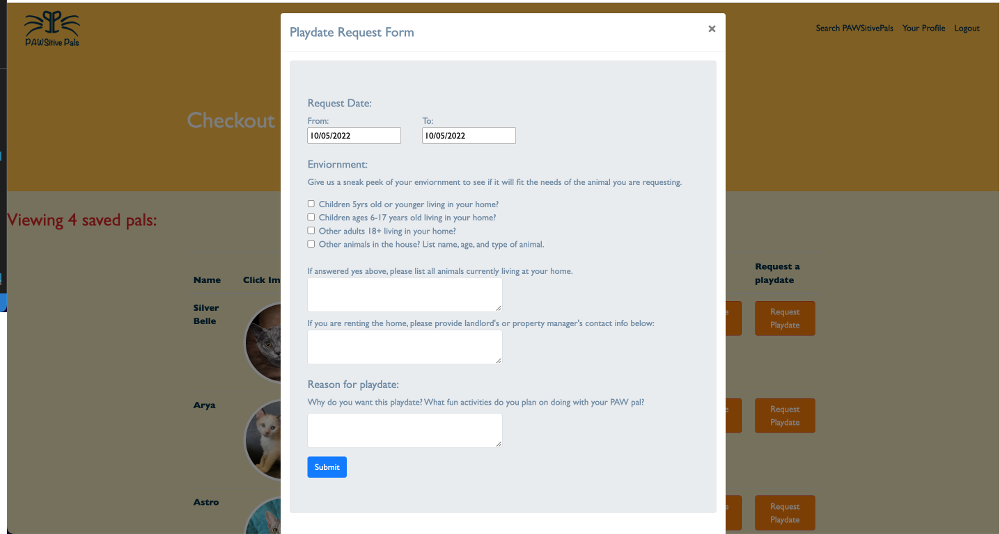

# PAWSitive Pals
​
## Table of contents
​
- [Overview](#overview)
  - [The challenge](#the-challenge)
  - [User Story](#user-story)
  - [Acceptance Criteria](#acceptance-criteria)
  - [Screenshot](#screenshot)
  - [Links](#links)
- [our process](#my-process)
  - [Built with](#built-with)
  - [What we learned](#what-we-learned)
  - [Continued development](#continued-development)
- [Author](#author)
- [Acknowledgments](#acknowledgments)
​​
## Overview
This project was aimed to collaboratively design and build an Interactive MERN Stack Single-Page Application. A pet playdate application was designed and created using MongDB back end, GraphQL, Express, Node, React and JWT

### The challenge
​
This is a collaborative project to create a real world full stack application by showcasing skills we have acquired so far in our coding bootcamp. This project aims to provide people with practical application using GraphQL with Node.js and Express.js to create a MERN-stack single-page application. This application also requires the usage of React, MongoDB, Mongoose ODM, and JWT as an authentication middleware.
​
### User Story
​
```
AS A regular person
I WANT to be able to set up playdates for X amount of hours/days with an animal at a shelter or adoption organization
SO THAT I can get have a pet friend or get the experience of what it may be like to own a pet without the full commitment of adopting.
```

### Acceptance Criteria
​
```
GIVEN a user friendly web application
WHEN I input my username and password
THEN I sign up and log in to my account
WHEN I search for a type of animal on the application (ex: dogs, cats, rabbits, guinea pigs, etc.) 
THEN I will see a list of said animal that are available for playdates
WHEN I select on the animal that matches my interests
THEN I am presented with a playdate request form to fill out
WHEN I submit the form, it will be send to the shelter / adoption organization for approval
THEN I will recieve a notice of the playdate approval status by the shelter / adoption organization
WHEN I set up a pick up time and location of animal
THEN I have the animal for said about on time
WHEN I spend time and hangout with the animal
THEN I am able to take pictures and make posts on the animal's profile page for other users to see
WHEN I return the animal back to the shelter
THEN I can plan another playdate with a different animal, plan for an adoption, or view other animal profiles
```
​
### Screenshot
​
Below is a screenshot showing a search for cat paw pals:


Below is a screenshot showing a list of favorite animals saved by a user:


Below is a screenshot showing the playdate request form:

​
### Deployment
​
- Live deployment[Heroku-page](https://pawsitive-pals.herokuapp.com)
- Github repository [Github](https://github.com/project-3-collab/Pawsitive-Pals)
​
## Our process
We started with being proactive in brainstorming a few ideas. Once we ​figured out with what kind of 
app we wanted to build we immediately started a wireframe. From there we designed each page that we 
wanted to include in our app, made a checklist of all items we needed to complete and started to delegate
each task to a team member. We constantly checked in with each other and discussed the best ways in which we could complete our tasks. We continued to monitor each other's progress and updated our wireframe througout the process as the mechanics behind our project beceame more clear. Most of the back end was created first and then the front end was completed afterwards. 


### Built with
​
- GraphQL
- Node.js
- Express.js
- MongoDB / Mongoose ODM
- React
- JWT
- .env
- Heroku
- Javascript

### What we learned
​
This project was a great opportunity to showcase the skills we have learned in the bootcamp. In addition to setting a stronger coding foundation, we learned the intricacies of creating an application with the front end and back end. With the back end, we were able to set up a server and create a database. We used React for the front end of our application. 

In addition to the skills to code the application, we learned how to work in a team. Each of our team members had different backgrounds, so learning how to showcase each of our strengths was proven to be efficacious. We also learned that communication was key to the development of our app. 

### Continued development
​
Although we are proud of what we have made, there are still more room for improvement:

-Shelter can create an account to add eligible animals
-Users can add their own pets to set up playdates with other pet owners
-Donation page (to shelter?)
-Some sort of background check for users to ensure safety of animals
-Make users rate-able by shelters as another animal safety aspect
-Link on pet page to org where you can adopt the pet
-Add/ delete user comments to a post
-Flag /ban users from site due to sketchiness
-Users can delete account
-Ranking pets


## Authors
​
- Portfolio
  - [Dennis Nguyen]() 
  - [Nifer Kilakila](https://nanifer.github.io/Nifer-Kilakila-Portfolio-in-React/)
  - [Lillian Kim](https://liliankim.github.io/homework-2/)
  - [Adriane Ocampo](https://ocampoad.github.io/Adriane_Ocampo_Portfolio/)
  - [Monineath Sar](https://monineathsar.github.io/My_Portfolio-Challenge2/)

- Github
  - [Dennis Nguyen](https://github.com/dnsnguy08) 
  - [Nifer Kilakila](https://github.com/NaNifer)
  - [Lillian Kim](https://github.com/liliankim)
  - [Adriane Ocampo](https://github.com/ocampoad)
  - [Monineath Sar](https://github.com/monineathsar)
  
## Acknowledgments
​ 
We appreciate all the time, help and support the TA provided us. We would like to give a shout out to Luigi, Scott, Paul and all the TA's. 
